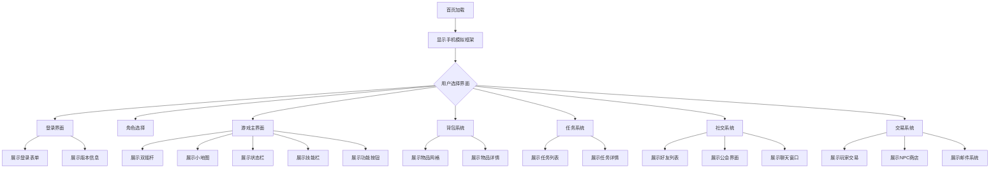

# Android APP 功能界面展示 - 产品需求文档

## 1. 产品概述

本项目是一个Web展示页面，用于展示传奇类MMORPG游戏Android客户端的功能界面UI。通过模拟手机屏幕的方式，向用户直观展示游戏的核心功能模块和交互界面。

- **目标用户**：游戏运营团队、市场推广人员、潜在玩家
- **核心价值**：让用户在不安装APP的情况下，直观了解游戏的界面设计和功能特点

## 2. 核心功能

### 2.1 功能模块

1. **首页展示**：手机模拟器框架 + 核心界面切换导航
2. **登录界面**：账号登录、注册入口、版本信息展示
3. **角色选择**：角色列表、角色创建、角色删除
4. **游戏主界面**：双摇杆、小地图、状态栏、技能栏、功能按钮
5. **背包系统**：物品网格、物品详情、装备操作
6. **任务系统**：任务列表、任务详情、任务追踪
7. **社交系统**：好友列表、公会界面、聊天窗口
8. **交易系统**：玩家交易、商店购买、邮件系统

### 2.2 页面详情

| 页面名称 | 模块名称 | 功能描述 |
|---------|---------|---------|
| 首页 | 手机模拟框架 | 展示Android手机外框，包含状态栏、导航栏模拟 |
| 首页 | 界面导航 | 底部Tab导航，快速切换不同功能界面 |
| 登录界面 | 登录表单 | 账号输入框、密码输入框、登录按钮、注册入口 |
| 登录界面 | 版本信息 | 游戏版本号、服务器状态显示 |
| 角色选择 | 角色卡片 | 角色头像、名称、等级、职业展示 |
| 角色选择 | 操作按钮 | 进入游戏、创建角色、删除角色 |
| 游戏主界面 | 双摇杆 | 左侧行走摇杆、右侧攻击摇杆 |
| 游戏主界面 | 小地图 | 右上角小地图、位置标记 |
| 游戏主界面 | 状态栏 | HP球、MP球、经验条 |
| 游戏主界面 | 技能栏 | 底部技能快捷栏、药品快捷栏 |
| 游戏主界面 | 功能按钮 | 背包、状态、自动战斗、跟随等按钮 |
| 背包系统 | 物品网格 | 6x8物品格子网格 |
| 背包系统 | 物品详情 | 物品图标、名称、属性描述 |
| 背包系统 | 操作按钮 | 使用、装备、丢弃、整理 |
| 任务系统 | 任务列表 | 可接任务、进行中任务、已完成任务 |
| 任务系统 | 任务详情 | 任务标题、描述、目标、奖励 |
| 社交系统 | 好友列表 | 在线好友、离线好友、添加好友 |
| 社交系统 | 公会界面 | 公会信息、成员列表、公会活动 |
| 社交系统 | 聊天窗口 | 频道选择、消息输入、聊天记录 |
| 交易系统 | 玩家交易 | 交易物品槽、金币输入、确认交易 |
| 交易系统 | NPC商店 | 商品列表、购买按钮、价格显示 |
| 交易系统 | 邮件系统 | 邮件列表、邮件内容、附件领取 |

## 3. 核心流程

## 4. 用户界面设计

### 4.1 设计风格

- **主题风格**：复古传奇风格，深色系背景，金色/红色点缀
- **主色调**：
  - 主色：深褐色 `#2a1810`（背景）
  - 强调色：金色 `#c9a227`（边框、标题）
  - 辅助色：暗红色 `#8b0000`（按钮、重要元素）
  - 文字色：米白色 `#f5e6d3`（正文）
- **字体**：
  - 标题：使用粗体衬线字体，营造古典感
  - 正文：清晰易读的无衬线字体
- **按钮风格**：3D立体按钮，带有金属质感边框
- **布局风格**：模拟真实手机屏幕，固定比例展示

### 4.2 页面设计概述

| 页面名称 | 模块名称 | UI元素 |
|---------|---------|--------|
| 首页 | 手机框架 | 圆角矩形外框、刘海屏设计、状态栏（时间、电量、信号） |
| 首页 | 导航栏 | 底部固定导航、图标+文字、选中高亮效果 |
| 登录界面 | 背景 | 古城背景图、半透明遮罩 |
| 登录界面 | 表单 | 金属质感输入框、立体登录按钮 |
| 角色选择 | 角色卡片 | 卡片式布局、角色立绘、职业图标 |
| 游戏主界面 | 摇杆 | 圆形底座、可拖动摇杆头 |
| 游戏主界面 | 状态球 | 渐变填充球体、数值显示 |
| 游戏主界面 | 技能栏 | 方形格子、技能图标、冷却遮罩 |
| 背包系统 | 物品格 | 网格布局、物品图标、数量角标 |
| 任务系统 | 任务卡片 | 标题+描述布局、进度条、奖励图标 |
| 社交系统 | 列表项 | 头像+名称+状态、在线指示灯 |
| 交易系统 | 交易框 | 双方交易区域、中间金币图标 |

### 4.3 响应式设计

- **桌面优先**：主要针对桌面浏览器展示，手机模拟器居中显示
- **移动端适配**：小屏幕下自动缩放手机模拟器尺寸
- **触摸优化**：支持触摸滑动切换界面

### 4.4 动效设计

- **界面切换**：平滑过渡动画（300ms）
- **按钮交互**：按下缩放效果、悬停发光效果
- **摇杆模拟**：拖动跟随效果
- **状态球**：脉动呼吸动画
- **技能冷却**：旋转遮罩动画