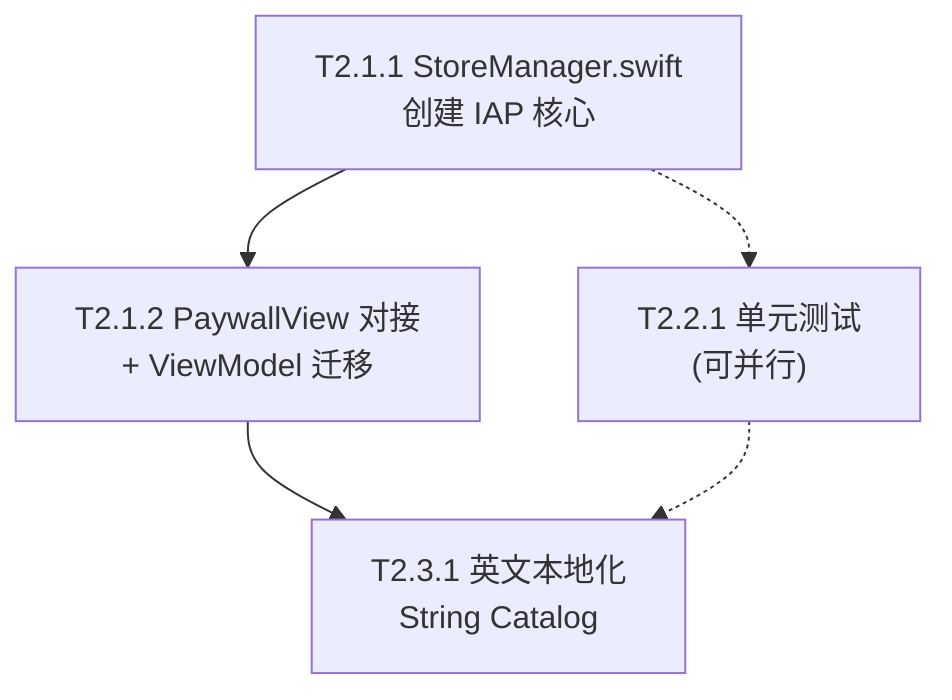

# S2 体验强化 — 实施计划

> 基于 [implementation_plan.md](file:///Users/shen/SZG/PRD/PoseAI/PRD/implementation_plan.md) 中 S2 阶段的任务定义
> Bundle ID: `com.lucas.poseai.studio1`
> 目标：接入真实商业化能力，建立测试安全网，扩展国际市场

---

## 核心原则

> [!IMPORTANT]
> 1. **不影响已有业务逻辑** — 所有改动通过增量方式，不修改现有 Views/Models 的行为
> 2. **StoreKit 2 原生 API** — 不使用 RevenueCat 等第三方 SDK，减少依赖和上架风险
> 3. **@AppStorage("isPro") 向后兼容** — 新旧 Pro 状态判定平滑过渡

---

## T2.1.1 — 创建 StoreManager（StoreKit 2 真实接入）

### 概述

创建 `StoreManager.swift`，使用 StoreKit 2 原生 API 实现完整的 IAP 流程，替换当前 `@AppStorage("isPro")` 的模拟逻辑。

### 新增文件

#### [NEW] [StoreManager.swift](file:///Users/shen/SZG/PRD/PoseAI/PoseAI/StoreManager.swift)

```swift
import StoreKit
import SwiftUI

@MainActor
final class StoreManager: ObservableObject {
    // 商品 ID（App Store Connect 需配置对应项，终身买断用非消耗型）
    static let proProductID = "com.lucas.poseai.studio1.pro.lifetime"
    
    // MARK: 状态
    @Published var products: [Product] = []
    @Published var purchasedProductIDs: Set<String> = []
    @Published var isLoading = false
    @Published var errorMessage: String? = nil
    
    // MARK: Pro 判定（兼容旧 AppStorage）
    @AppStorage("isPro") private var isProLegacy = false
    
    var isPro: Bool {
        purchasedProductIDs.contains(Self.proProductID) || isProLegacy
    }
    
    // MARK: Transaction 监听任务
    private var updateListenerTask: Task<Void, Never>? = nil
    
    init() {
        updateListenerTask = listenForTransactions()
        Task { await loadProducts(); await updatePurchasedProducts() }
    }
    
    deinit { updateListenerTask?.cancel() }
    
    // 1. 加载商品
    func loadProducts() async { ... }
    
    // 2. 购买
    func purchase(_ product: Product) async throws { ... }
    
    // 3. 恢复购买
    func restorePurchases() async { ... }
    
    // 4. 监听 Transaction 更新（退款、家庭共享等）
    private func listenForTransactions() -> Task<Void, Never> { ... }
    
    // 5. 刷新已购商品
    func updatePurchasedProducts() async { ... }
}
```

**关键设计**：
- `isPro` 计算属性同时检查 StoreKit 2 和旧 `@AppStorage`，平滑迁移
- `@MainActor` 确保所有 UI 状态更新在主线程
- `listenForTransactions()` 后台监听退款/家庭共享/订阅续期
- 商品类型：**非消耗型（Non-Consumable）** 终身买断

### 新增文件

#### [NEW] [Configuration.storekit](file:///Users/shen/SZG/PRD/PoseAI/PoseAI/Configuration.storekit)

StoreKit Configuration File，用于 Xcode 本地沙盒测试：
- 1 个非消耗型商品：`com.lucas.poseai.studio1.pro.lifetime`
- 价格 ¥98 / $12.99
- 支持沙盒购买/恢复/退款测试

---

## T2.1.2 — PaywallView 对接真实 IAP

### 修改文件

#### [MODIFY] [PaywallView.swift](file:///Users/shen/SZG/PRD/PoseAI/PoseAI/PaywallView.swift)

**改动点**：

| 位置 | 当前 | 改为 |
|------|------|------|
| L6 | `@AppStorage("isPro") var isPro = false` | `@EnvironmentObject var storeManager: StoreManager` |
| L77 | 硬编码 `¥98 / 终身买断` | 从 `storeManager.products` 动态读取 `displayPrice` |
| L84-91 | 模拟购买 `isPro = true` + dismiss | `try await storeManager.purchase(product)` |
| L109 | 空操作 `恢复购买` | `await storeManager.restorePurchases()` |
| 新增 | — | 加载态 ProgressView + 错误 Alert |

**新增 UI 状态**：
- **加载中**：商品未加载时显示 `ProgressView` 替代价格和按钮
- **购买中**：点击购买后按钮变为不可点击 + Loading
- **错误态**：购买失败时显示 Alert（网络错误 / 用户取消 / 其他）
- **已购买**：如果已是 Pro，显示"已解锁"状态

---

#### [MODIFY] [ShootingViewModel.swift](file:///Users/shen/SZG/PRD/PoseAI/PoseAI/ShootingViewModel.swift)

**改动点**：

| 位置 | 当前 | 改为 |
|------|------|------|
| L48 | `@AppStorage("isPro") var isPro = false` | 移除，改为通过 StoreManager 注入 |
| L74-80 | `isPremiumScene` / `requiresProUnlock` 直接读 `isPro` | 读取 `storeManager.isPro` |
| L280 | `triggerAutoPhoto()` 中 `isPro ? 3 : 1` | 通过 storeManager 判定 |

**注入方式**：在 ViewModel 中持有 `StoreManager` 引用（通过初始化参数传入或 EnvironmentObject）

---

#### [MODIFY] [PoseAIApp.swift](file:///Users/shen/SZG/PRD/PoseAI/PoseAI/PoseAIApp.swift)

**改动点**：
- 创建 `@StateObject var storeManager = StoreManager()` 
- 通过 `.environmentObject(storeManager)` 注入到视图树
- 同时传递给 `ShootingViewModel`

---

#### [MODIFY] [ContentView.swift](file:///Users/shen/SZG/PRD/PoseAI/PoseAI/ContentView.swift)

**改动点**：
- `PaywallView()` 调用时传入 `storeManager` 环境
- `PhotoPreviewView` 中 `@AppStorage("isPro")` 改为环境注入

---

## T2.2.1 — 单元测试基建

### 概述

创建 `PoseAITests` Target，为最核心的三个模块编写单元测试。

> [!WARNING]
> 当前项目没有 Test Target（`project.pbxproj` 中无 `PoseAITests` 引用），需要通过 Xcode 手动创建 Test Target 后再编写测试文件。**测试文件可以先编写好，但 Target 需要在 Xcode 中操作创建。**

### 新增文件

#### [NEW] PoseAITests/PoseMatcherTests.swift

```
PoseMatcherTests/
├── testAngleCalculation_rightAngle()           # 90° 标准验证
├── testAngleCalculation_zeroPoint()            # 零向量边界
├── testSimilarity_identicalPose_returns100()   # 完全匹配 → 100
├── testSimilarity_emptyPoints_returns0()       # 空点集 → 0
├── testSimilarity_halfBody_skipsLower()        # 半身模式跳过下半身
├── testSimilarity_toleranceThreshold()         # 5° 容错验证
├── testSimilarity_oppositeArms()               # 手臂反向 → 低分
```

#### [NEW] PoseAITests/SceneDebounceTests.swift

```
SceneDebounceTests/
├── testSingleFrame_noChange()                  # 单帧不触发
├── testConsecutiveSame_triggers()              # 连续 2 帧一致触发
├── testUnknown_ignored()                       # unknown 不进 buffer
├── testMixedFrames_noTrigger()                 # 交替场景不触发
```

#### [NEW] PoseAITests/ModelTests.swift

```
ModelTests/
├── testAllScenes_havePlans()                   # 7 个场景都有方案（unknown 除外）
├── testEachScene_has3Plans()                   # 每场景 3 套方案
├── testPlanIds_unique()                        # 21 个 ID 无重复
├── testComposition_allRulesHaveOffset()        # 构图规则都有偏移值
├── testFrameRatio_heightRatiosValid()          # 高度比例在合理范围
```

---

## T2.3.1 — 英文本地化

### 概述

将所有中文硬编码字符串提取为 `String(localized:)` 调用，创建 String Catalog 支持中英双语。

### 新增文件

#### [NEW] Localizable.xcstrings

Xcode 15+ String Catalog 格式，包含约 80+ 条翻译键值对。

### 修改文件

需要修改所有包含中文硬编码的文件：

| 文件 | 中文字符串数量(约) | 示例 |
|------|-------------------|------|
| ContentView.swift | ~25 | "识别场景中…", "需要摄像头权限", "光线不足" |
| ShootingViewModel.swift | ~10 | "对齐啦，保持不动！", "未能识别背景", "拍好了" |
| PaywallView.swift | ~10 | "解锁 PoseAI Pro", "全场景方案库" |
| OnboardingView.swift | ~15 | 引导页所有文案 |
| PhotoPreviewView.swift | ~5 | "重拍", "保存", "分享", "本次拍摄" |
| Models.swift | ~20 | 场景 displayName, 构图 reason, voiceHint |

**语音播报国际化**：
```swift
// 当前
utterance.voice = AVSpeechSynthesisVoice(language: "zh-CN")

// 改为
let lang = Locale.current.language.languageCode?.identifier == "zh" ? "zh-CN" : "en-US"
utterance.voice = AVSpeechSynthesisVoice(language: lang)
```

**Info.plist 权限文案国际化**：
- `NSCameraUsageDescription` → 中/英双语
- `NSPhotoLibraryAddUsageDescription` → 中/英双语

---

## 文件变更总览

| 操作 | 文件 | 说明 |
|------|------|------|
| 🆕 新增 | `StoreManager.swift` | StoreKit 2 IAP 核心 |
| 🆕 新增 | `Configuration.storekit` | 沙盒测试配置 |
| 🆕 新增 | `PoseAITests/PoseMatcherTests.swift` | 算法测试 |
| 🆕 新增 | `PoseAITests/SceneDebounceTests.swift` | 防抖测试 |
| 🆕 新增 | `PoseAITests/ModelTests.swift` | 模型完整性测试 |
| 🆕 新增 | `Localizable.xcstrings` | 国际化字符串 |
| ✏️ 修改 | `PaywallView.swift` | 对接真实 IAP |
| ✏️ 修改 | `ShootingViewModel.swift` | 移除模拟 isPro |
| ✏️ 修改 | `PoseAIApp.swift` | 注入 StoreManager |
| ✏️ 修改 | `ContentView.swift` | 环境传递 + 国际化 |
| ✏️ 修改 | `OnboardingView.swift` | 国际化 |
| ✏️ 修改 | `PhotoPreviewView.swift` | 国际化 + isPro 迁移 |
| ✏️ 修改 | `Models.swift` | displayName 等国际化 |

---

## 执行顺序



> 1. **先做 T2.1.1 + T2.1.2**（IAP 是上架硬阻塞，优先级最高）
> 2. **T2.2.1 可并行**（不依赖 IAP，但需要 Xcode 手动添加 Test Target）
> 3. **最后做 T2.3.1**（需要所有文件稳定后再提取字符串，避免重复工作）

---

## 验证计划

### 自动化测试
- `xcodebuild test` 运行 PoseMatcherTests / SceneDebounceTests / ModelTests
- 预期通过率 100%

### 手动验证
1. **IAP 沙盒测试**：Xcode StoreKit Configuration → 购买/恢复/退款全流程
2. **PaywallView 状态**：加载中/购买中/成功/失败/已购买 5 种状态切换
3. **国际化验证**：切换 iPhone 语言为 English → 验证所有界面文案
4. **语音播报**：英文环境下 TTS 使用 en-US 语音

---

## User Review Required

> [!IMPORTANT]
> **请确认以下决策点**：
> 1. **商品 ID** — 计划使用 `com.lucas.poseai.studio1.pro.lifetime`（非消耗型终身买断），是否已在 App Store Connect 创建此商品？
> 2. **价格方案** — 保持 ¥98 终身买断，还是改为订阅制？这会影响 StoreKit 实现方式
> 3. **测试 Target** — 需要在 Xcode 中手动添加 Unit Test Target，是否由你操作还是我提供操作步骤？
> 4. **国际化范围** — PoseLibrary（21 套方案的 `poseName`/`poseDescription`/`voiceGuide`）是否也需要翻译为英文？这些是用户可见的核心文案
