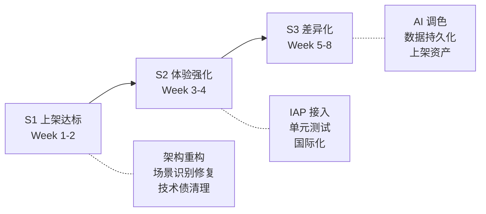
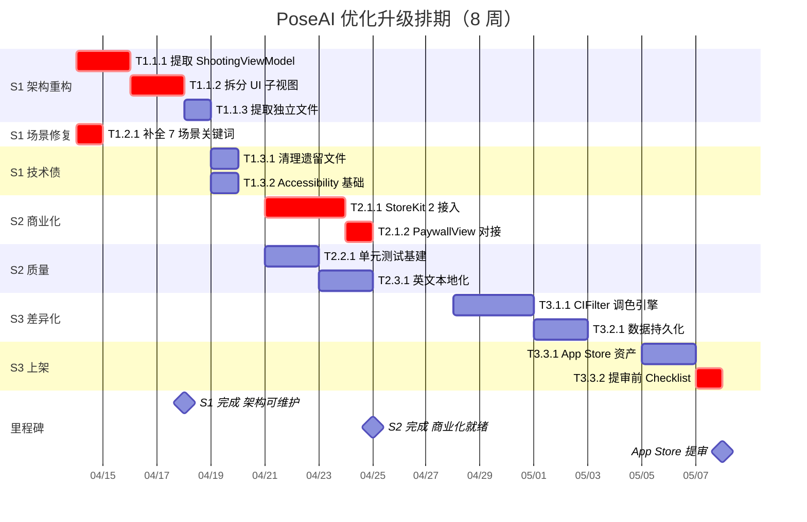

# PoseAI 优化升级 — 实施计划与任务排期

> 基于 [项目全景分析报告](file:///Users/shen/.gemini/antigravity/brain/ec4893e5-43eb-4ad1-86ca-1b7372241b80/project_analysis_report.md) 制定
> 目标：**4 周内完成上架达标，8 周内建立差异化壁垒**

---

## 总体策略

采用 **三阶段渐进交付** 策略，每阶段有明确的交付物和验收标准：



> [!IMPORTANT]
> **核心原则**：每个任务必须不影响已有业务逻辑。重构过程中保持功能不变，新增功能通过 Feature Flag 控制。

---

## S1 — 上架达标（Week 1-2）

> 目标：解决阻塞上架的架构问题和产品缺陷，让代码具备可维护性

### Sprint 1.1 — 架构重构（3 天）

#### T1.1.1 提取 ShootingViewModel

| 属性 | 值 |
|------|-----|
| 优先级 | 🔴 P0 |
| 预估工时 | 8h |
| 前置依赖 | 无 |
| 交付物 | `ShootingViewModel.swift` |

**具体步骤**：
1. 创建 `ShootingViewModel: ObservableObject`
2. 将 ContentView 中 30+ 个 `@State` 迁移为 `@Published` 属性：
   - 场景与方案状态：`scene`, `currentPlanIndex`, `isSceneReady`, `score` 等
   - 拍摄状态：`stableStartTime`, `isCapturing`, `burstImages`, `countdown` 等
   - UI 状态：`showGuide`, `showCompositionTip`, `isImmersiveMode` 等
3. 将 `bind()` 中 140 行回调逻辑迁移为 ViewModel 方法
4. 将 `triggerAutoPhoto()`, `takeBurst()`, `handleShutterTap()`, `speak()` 等迁移
5. ContentView 通过 `@StateObject private var vm = ShootingViewModel()` 引用

**验收标准**：功能行为完全不变，ContentView 行数降至 800 行以下。

---

#### T1.1.2 拆分 UI 子视图

| 属性 | 值 |
|------|-----|
| 优先级 | 🔴 P0 |
| 预估工时 | 6h |
| 前置依赖 | T1.1.1 |
| 交付物 | 4 个新文件 |

**具体步骤**：
1. `TopBarView.swift` — 提取场景信息卡 + 分数环 + 帮助按钮（原 L312-416）
2. `BottomControlView.swift` — 提取方案选择器 + 快门按钮 + 控制行（原 L514-730）
3. `CameraOverlayView.swift` — 提取扫描动画 + 剪影 + 辅助线 + 脚印（原 L419-512, L1254-1484）
4. `AlertOverlaysView.swift` — 提取俯拍警告 + 留白提醒 + 暗光 Banner + 构图提示（原 L772-830）

**目标文件结构**：
```
PoseAI/
├── Views/
│   ├── ContentView.swift          # ≤400 行，纯 ZStack + 组装
│   ├── TopBarView.swift           # ~120 行
│   ├── BottomControlView.swift    # ~220 行
│   ├── CameraOverlayView.swift    # ~250 行
│   └── AlertOverlaysView.swift    # ~80 行
├── ViewModels/
│   └── ShootingViewModel.swift    # ~400 行
├── Features/
│   ├── PhotoPreviewView.swift     # 已独立，直接移入
│   ├── PaywallView.swift          # 提取自 ContentView
│   ├── SessionGallerySheet.swift  # 提取自 ContentView
│   └── PoseGuideSheet.swift       # 提取自 ContentView
├── Components/
│   ├── PlanCard.swift             # 提取自 ContentView
│   ├── TagBadge.swift             # 提取自 ContentView
│   ├── SilhouetteGuideOverlay.swift
│   ├── CompositionGuideLines.swift
│   └── ScanCornerLines.swift
└── ...（Services/Models 不变）
```

**验收标准**：`ContentView.swift` ≤ 400 行；所有子视图通过 ViewModel 获取数据；编译通过且功能无回归。

---

#### T1.1.3 提取独立文件（PaywallView 等）

| 属性 | 值 |
|------|-----|
| 优先级 | 🟡 P1 |
| 预估工时 | 2h |
| 前置依赖 | T1.1.2 |
| 交付物 | 独立的 Feature 文件 |

将 ContentView.swift 中已经结构独立但物理上还在同一文件的组件提取为独立文件：
- `PaywallView.swift`（原 L1890-2037）
- `SessionGallerySheet.swift`（原 L1832-1888）
- `PhotoPreviewView.swift`（原 L1640-1828）
- `PoseGuideSheet.swift`（原 L1487-1631）
- 水印扩展 `UIImage+Watermark.swift`（原 L1792-1828）

---

### Sprint 1.2 — 场景识别修复（1 天）

#### T1.2.1 补全 7 场景关键词投票

| 属性 | 值 |
|------|-----|
| 优先级 | 🔴 P0 |
| 预估工时 | 3h |
| 前置依赖 | 无 |
| 影响文件 | `Models.swift` |

**具体步骤**：
1. 扩展 `votes` 字典，增加 `city_street`, `park`, `indoor_home`, `neon_night` 4 个 key
2. 为每个新场景添加 ImageNet 关键词映射：
   - **城市街道**：`street`, `traffic`, `car`, `taxi`, `bus`, `crosswalk`, `skyscraper`, `bridge`, `sign`, `pedestrian`, `billboard` 等
   - **公园**：`park`, `bench`, `fountain`, `playground`, `swing`, `picnic`, `lawn`, `gazebo` 等
   - **室内家居**：`bedroom`, `living_room`, `bathroom`, `kitchen`, `wardrobe`, `television`, `bed`, `pillow` 等
   - **夜晚霓虹**：`neon`, `night`, `lantern`, `spotlight`, `lamppost`, `cinema`, `marquee`, `stage` 等
3. 调整投票权重阈值，确保新场景可被识别

**验收标准**：在真机上对 7 种场景各拍摄 3 张测试图，识别准确率 ≥ 60%。

---

### Sprint 1.3 — 技术债清理（1 天）

#### T1.3.1 清理遗留文件和代码

| 属性 | 值 |
|------|-----|
| 优先级 | 🟢 P2 |
| 预估工时 | 1h |
| 前置依赖 | 无 |

- [ ] 删除 `Poses.json`（已被 PoseLibrary 硬编码替代）
- [ ] 删除 `test_vision.swift`（项目根目录遗留）
- [ ] 移除 `Pose` 结构体（Models.swift L7-9）及相关 `recommendedPose` 属性
- [ ] 所有 `print()` 语句包裹 `#if DEBUG`
- [ ] `UIGraphicsBeginImageContextWithOptions` → `UIGraphicsImageRenderer`

#### T1.3.2 Accessibility 基础支持

| 属性 | 值 |
|------|-----|
| 优先级 | 🟢 P2 |
| 预估工时 | 2h |
| 前置依赖 | T1.1.2 |

- [ ] 快门按钮添加 `.accessibilityLabel("拍照")`
- [ ] 分数环添加 `.accessibilityValue("匹配度 \(Int(score))%")`
- [ ] 方案卡片添加 `.accessibilityLabel("\(plan.poseName), \(plan.composition.displayName)构图")`
- [ ] 前后置切换添加 `.accessibilityLabel("切换摄像头")`

---

## S2 — 体验强化（Week 3-4）

> 目标：接入真实商业化能力，建立测试安全网，扩展国际市场

### Sprint 2.1 — StoreKit 2 真实接入（3 天）

#### T2.1.1 创建 StoreManager

| 属性 | 值 |
|------|-----|
| 优先级 | 🔴 P0 |
| 预估工时 | 10h |
| 前置依赖 | T1.1.1 |
| 交付物 | `StoreManager.swift` + `StoreKit Configuration` |

**具体步骤**：
1. 创建 `StoreManager: ObservableObject`
   - `@Published var products: [Product]`
   - `@Published var purchasedProductIDs: Set<String>`
   - `var isPro: Bool { purchasedProductIDs.contains("com.poseai.pro") }`
2. 实现商品加载：`Product.products(for:)`
3. 实现购买流程：`product.purchase()` → `Transaction.currentEntitlement`
4. 实现恢复购买：`Transaction.all` 遍历
5. 实现 `Transaction.updates` 后台监听
6. 创建 StoreKit Configuration File 用于本地测试
7. 替换 `@AppStorage("isPro")` 为 StoreManager 驱动

**验收标准**：沙盒环境下完成购买/恢复购买/订阅过期全流程。

#### T2.1.2 更新 PaywallView 对接

| 属性 | 值 |
|------|-----|
| 优先级 | 🔴 P0 |
| 预估工时 | 3h |
| 前置依赖 | T2.1.1 |

- [ ] PaywallView 从 StoreManager 读取商品价格（动态显示）
- [ ] 购买按钮调用 `storeManager.purchase(product)`
- [ ] 恢复购买按钮调用 `storeManager.restorePurchases()`
- [ ] 加载态 + 错误态 UI 处理
- [ ] 移除模拟购买代码

---

### Sprint 2.2 — 单元测试基建（2 天）

#### T2.2.1 建立 XCTest Target

| 属性 | 值 |
|------|-----|
| 优先级 | 🟡 P1 |
| 预估工时 | 8h |
| 前置依赖 | T1.1.1 |
| 交付物 | `PoseAITests` Target |

**优先覆盖的测试用例**：

```
PoseMatcherTests/
├── testAngleCalculation_rightAngle()           # 90° 标准验证
├── testAngleCalculation_zeroPoint()            # 零向量边界
├── testSimilarity_identicalPose_returns100()   # 完全匹配 → 100
├── testSimilarity_emptyPoints_returns0()       # 空点集 → 0
├── testSimilarity_halfBody_skipsLower()        # 半身模式跳过下半身
├── testSimilarity_toleranceThreshold()         # 5° 容错验证
├── testSimilarity_oppositeArms()               # 手臂反向 → 低分

SceneDebounceTests/
├── testSingleFrame_noChange()                  # 单帧不触发
├── testConsecutiveSame_triggers()              # 连续 2 帧一致触发
├── testUnknown_ignored()                       # unknown 不进 buffer
├── testMixedFrames_noTrigger()                 # 交替场景不触发

ModelTests/
├── testAllScenes_havePlans()                   # 7 个场景都有方案（unknown 除外）
├── testEachScene_has3Plans()                   # 每场景 3 套方案
├── testPlanIds_unique()                        # 21 个 ID 无重复
```

---

### Sprint 2.3 — 英文本地化（1 天）

#### T2.3.1 String Catalog 国际化

| 属性 | 值 |
|------|-----|
| 优先级 | 🟡 P1 |
| 预估工时 | 5h |
| 前置依赖 | T1.1.2 |

**具体步骤**：
1. 创建 `Localizable.xcstrings`（Xcode 15+ String Catalog）
2. 提取所有中文硬编码字符串为 `String(localized:)`
3. 补充英文翻译（约 80+ 条）
4. Info.plist 权限文案国际化
5. 语音播报根据 Locale 切换语言

---

## S3 — 差异化功能（Week 5-8）

> 目标：打造"一键大片"的差异化体验，完成上架资产

### Sprint 3.1 — AI 调色预设（3 天）

#### T3.1.1 CIFilter 调色引擎

| 属性 | 值 |
|------|-----|
| 优先级 | 🟡 P1 |
| 预估工时 | 10h |
| 前置依赖 | T1.1.3 |
| 交付物 | `PhotoFilterEngine.swift` + 更新 `PhotoPreviewView` |

**4 套滤镜预设**：

| 滤镜名 | 技术实现 | 风格 |
|--------|---------|------|
| 胶片感 Film | `CIColorCurves`（青暗部 + 暖高光）| 柯达胶卷调性 |
| 高级黑白 B&W | `CIPhotoEffectNoir` + `CISharpenLuminance` | 大反差强锐度 |
| 日系清透 Light | `CIExposureAdjust(+0.3)` + `CIVibrance(-0.2)` | 低对比过曝 |
| 城市霓虹 Neon | `CIColorMatrix`（Teal & Orange） | 青橙赛博朋克 |

**UI 交互**：PhotoPreviewView 底部新增滤镜横向选择器，实时预览 + 应用。

---

### Sprint 3.2 — 数据持久化（2 天）

#### T3.2.1 拍摄记录持久化

| 属性 | 值 |
|------|-----|
| 优先级 | 🟢 P2 |
| 预估工时 | 8h |
| 前置依赖 | T1.1.1 |
| 交付物 | `ShootingRecord` SwiftData Model + 历史页面 |

**数据模型**：
```swift
@Model
class ShootingRecord {
    var sceneType: String        // 场景
    var planName: String         // 方案名
    var matchScore: Double       // 最终匹配分
    var photoAssetID: String     // PHAsset localIdentifier
    var createdAt: Date
}
```

**功能点**：
- 拍照保存时自动写入记录
- 新增"拍摄历史"页面（按天分组 + 场景统计）
- 首页入口（侧滑或 Tab）

---

### Sprint 3.3 — 上架资产与提审（3 天）

#### T3.3.1 App Store 资产准备

| 属性 | 值 |
|------|-----|
| 优先级 | 🔴 P0 |
| 预估工时 | 6h |
| 前置依赖 | S1 + S2 全部完成 |

- [ ] 6.7 寸 + 6.1 寸截图各 6 张（真机录屏 + Figma 合成）
- [ ] 30 秒 App Preview 视频
- [ ] App 描述文案（中文 + 英文）
- [ ] 关键词优化（ASO）
- [ ] 隐私政策页面上线

#### T3.3.2 提审前 Checklist

| 属性 | 值 |
|------|-----|
| 优先级 | 🔴 P0 |
| 预估工时 | 4h |

- [ ] 全流程真机回归测试（iPhone 12/14/15 Pro）
- [ ] 性能 Profiling（Instruments → Leaks + Time Profiler）
- [ ] Crash 日志检查（无未处理异常）
- [ ] 确认 Bundle ID、版本号、Build 号
- [ ] TestFlight 内测分发 → 收集反馈
- [ ] 正式提交 App Store Connect

---

## 总任务排期甘特图



---

## 任务总览表

| 编号 | 任务名 | 优先级 | 工时 | 依赖 | 计划周 | 状态 |
|------|--------|--------|------|------|--------|------|
| T1.1.1 | 提取 ShootingViewModel | 🔴 P0 | 8h | - | W1 | `[ ]` |
| T1.1.2 | 拆分 UI 子视图 | 🔴 P0 | 6h | T1.1.1 | W1 | `[ ]` |
| T1.1.3 | 提取独立文件 | 🟡 P1 | 2h | T1.1.2 | W1 | `[ ]` |
| T1.2.1 | 补全 7 场景关键词 | 🔴 P0 | 3h | - | W1 | `[ ]` |
| T1.3.1 | 清理遗留文件 | 🟢 P2 | 1h | - | W2 | `[ ]` |
| T1.3.2 | Accessibility 基础 | 🟢 P2 | 2h | T1.1.2 | W2 | `[ ]` |
| T2.1.1 | StoreKit 2 接入 | 🔴 P0 | 10h | T1.1.1 | W3 | `[ ]` |
| T2.1.2 | PaywallView 对接 | 🔴 P0 | 3h | T2.1.1 | W3 | `[ ]` |
| T2.2.1 | 单元测试基建 | 🟡 P1 | 8h | T1.1.1 | W3 | `[ ]` |
| T2.3.1 | 英文本地化 | 🟡 P1 | 5h | T1.1.2 | W4 | `[ ]` |
| T3.1.1 | CIFilter 调色引擎 | 🟡 P1 | 10h | T1.1.3 | W5 | `[ ]` |
| T3.2.1 | 数据持久化 | 🟢 P2 | 8h | T1.1.1 | W6 | `[ ]` |
| T3.3.1 | App Store 资产 | 🔴 P0 | 6h | S1+S2 | W7 | `[ ]` |
| T3.3.2 | 提审前 Checklist | 🔴 P0 | 4h | T3.3.1 | W8 | `[ ]` |
| **合计** | | | **76h** | | | |

---

## 风险与应对

| 风险 | 概率 | 影响 | 应对策略 |
|------|------|------|---------|
| ContentView 拆分引入回归 Bug | 高 | 中 | 每步拆分后真机验证；T2.2.1 测试尽早跟进 |
| StoreKit 审核被拒 | 中 | 高 | 提前阅读 Apple 审核指南 3.1.1；使用 StoreKit 2 原生 API |
| Places365 模型兼容性 | 低 | 中 | 先用方案 A（关键词补全）保底；模型替换作为可选增强 |
| App Store 截图质量不达标 | 低 | 中 | 预留 2 天迭代时间；参考竞品截图风格 |

---

## User Review Required

> [!IMPORTANT]
> **以下决策点需要确认**：
> 1. **S1 架构重构** — 从 Week 1 开始拆分 ContentView，这是最大工作量也是最高风险项，是否认同优先执行？
> 2. **场景识别方案选择** — 优先用方案 A（补全关键词，2h）快速修复，还是直接上方案 B（Places365 模型替换，1d）？
> 3. **IAP 产品定义** — 当前设计为 ¥98 终身买断，是否考虑改为年订阅制（如 ¥48/年）？这会影响 StoreKit 接入方式。
> 4. **S3 差异化功能优先级** — AI 调色 vs 数据持久化，哪个对你更重要？可以调整顺序。
> 5. **上架目标日期** — 按当前排期 5 月 8 日提审，是否可接受？
