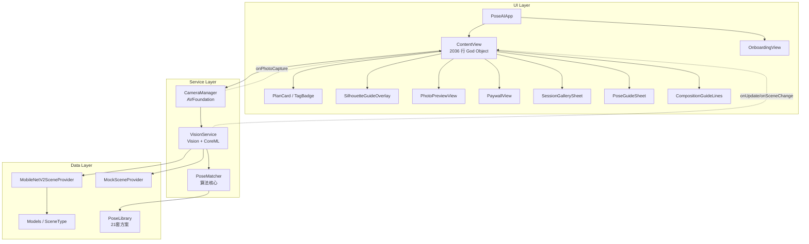
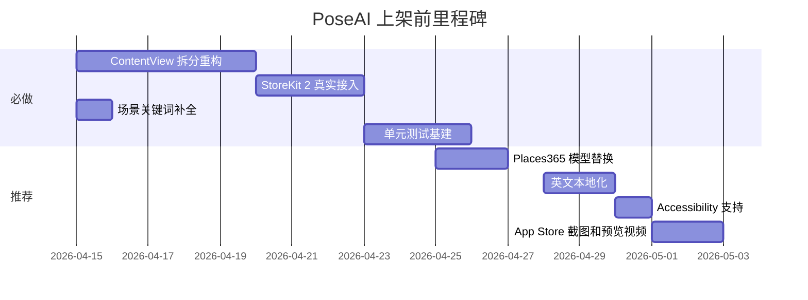
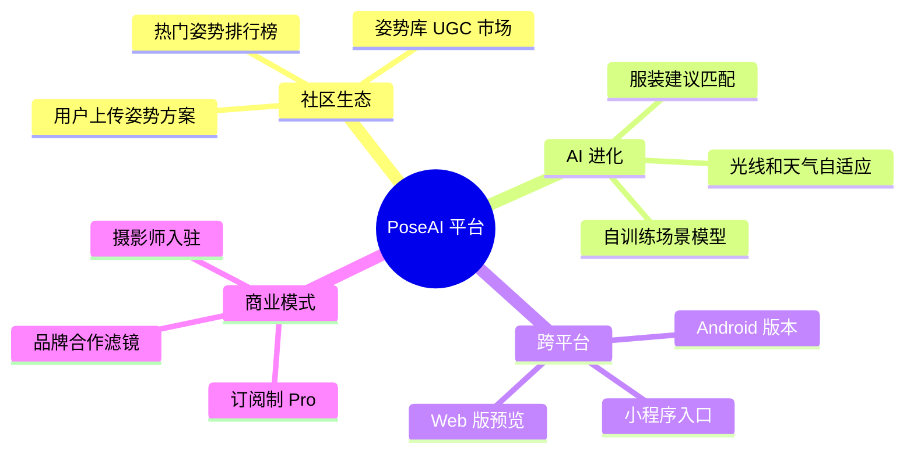

# PoseAI 项目全景分析报告

> 扫描时间：2026-04-11 | 代码规模：7 个 Swift 源文件，3,451 行有效代码 + 25MB ML 模型
> 版本状态：P0~P5 五个迭代阶段已基本完成，当前处于**上架前打磨**阶段

---

## 一、项目概览

### 1.1 产品定位
PoseAI 是一款**基于 Vision + CoreML 的实时场景感知姿势引导** iOS 拍照应用。核心价值主张是"让拍照小白也能拍出好构图"——通过 AI 识别场景 → 推荐姿势+构图 → 体型自适应剪影引导 → 自动拍照的闭环链路，降低用户摄影门槛。

### 1.2 技术栈总览

| 层级 | 技术选型 |
|------|---------|
| UI 框架 | SwiftUI（纯 SwiftUI，无 UIKit 混编 View） |
| 视觉引擎 | Apple Vision Framework（VNDetectHumanBodyPoseRequest + VNDetectFaceRectanglesRequest）|
| 场景分类 | MobileNetV2（Apple 官方 CoreML 模型，~25MB）+ 关键词投票扩充 |
| 摄像头管理 | AVFoundation（AVCaptureSession + PhotoOutput + VideoDataOutput）|
| 传感器 | CoreMotion（俯仰角检测）|
| 商业化 | StoreKit（SKStoreReviewController）+ 模拟 IAP |
| 语音引导 | AVSpeechSynthesizer |
| 最低系统 | iOS 16.0+, A12 Bionic+ |

### 1.3 代码体量分析

| 文件 | 行数 | 职责 | 复杂度评估 |
|------|------|------|-----------|
| [ContentView.swift](file:///Users/shen/SZG/PRD/PoseAI/PoseAI/ContentView.swift) | 2,036 | 主界面 + 所有 UI 组件 + 业务逻辑 | ⚠️ **极高**（God Object） |
| [Models.swift](file:///Users/shen/SZG/PRD/PoseAI/PoseAI/Models.swift) | 588 | 数据模型 + 姿势库 + 场景分类器 | 中等 |
| [CameraManager.swift](file:///Users/shen/SZG/PRD/PoseAI/PoseAI/CameraManager.swift) | 275 | 摄像头生命周期 + 曝光补偿 | 良好 |
| [OnboardingView.swift](file:///Users/shen/SZG/PRD/PoseAI/PoseAI/OnboardingView.swift) | 238 | 首次引导 + 隐私协议 | 良好 |
| [VisionService.swift](file:///Users/shen/SZG/PRD/PoseAI/PoseAI/VisionService.swift) | 205 | AI 推理调度 + 防抖 + 暗光检测 | 良好 |
| [PoseMatcher.swift](file:///Users/shen/SZG/PRD/PoseAI/PoseAI/PoseMatcher.swift) | 86 | 向量夹角匹配算法 | 优秀 |
| [PoseAIApp.swift](file:///Users/shen/SZG/PRD/PoseAI/PoseAI/PoseAIApp.swift) | 23 | App 入口 | 优秀 |
| **合计** | **3,451** | | |

---

## 二、架构分析

### 2.1 当前架构



### 2.2 架构优点 ✅

1. **Vision 推理零积压**：通过同步阻塞 Delegate 线程 + `alwaysDiscardsLateVideoFrames`，实现生产级硬丢帧策略，杜绝 OOM
2. **体型无关评分**：PoseMatcher 使用关节向量夹角而非坐标距离，天然免疫高矮胖瘦差异
3. **三层降级策略**：MobileNetV2 → MockProvider → 8 秒超时兜底，确保无模型时也能使用
4. **性能降级自适应**：根据温度和电量自动隔帧处理，兼顾性能与续航
5. **Sensor 坐标映射**：正确处理了 Vision 竖屏坐标到硬件 Landscape 物理坐标的转换
6. **EMA 平滑**：关节坐标指数移动平均消除暗光抖动

### 2.3 架构风险 ⚠️

| 风险等级 | 问题 | 影响 |
|---------|------|------|
| 🔴 严重 | **ContentView 是 2036 行的 God Object**，集成了 30+ 个 `@State`、所有回调绑定、全部 UI 子视图、拍摄逻辑、倒计时逻辑、语音播报、评分引擎 | 可维护性极差，无法并行开发，改一处牵动全文件 |
| 🟡 中等 | **无单元测试**：PoseMatcher/VisionService 等核心逻辑无任何测试覆盖 | 回归风险高，重构时无安全网 |
| 🟡 中等 | **IAP 为模拟实现**：`PaywallView` 的购买按钮直接 `isPro = true`，未接入真实 StoreKit | 上架前必须完成 |
| 🟡 中等 | **无数据持久化层**：拍摄历史仅存于 Session 内存，退出即丢失 | 用户体验断裂 |
| 🟡 中等 | **Poses.json 被废弃**：姿势数据已硬编码在 `PoseLibrary` 中，JSON 文件成为历史遗留 | 混淆理解 |
| 🟢 低 | **无 Accessibility 支持**：所有 UI 元素缺少 VoiceOver 标签 | App Store 审核可能被标记 |

---

## 三、模块深度审计

### 3.1 核心算法 — PoseMatcher

> [!TIP]
> **评价：设计优秀，是项目的技术亮点。**

- **向量夹角法**：通过 6 组三关节三元组计算 ∠ABC 角度差异，天然消除距离/体型变量
- **5° 容错门限**：有效抑制 Vision 推理噪声
- **半身模式自动切换**：下半身关节置信度 < 0.25 时自动跳过下半身三元组

**潜在优化点**：
- 仅 6 组三元组可能不足以区分相似姿势（如"侧身靠墙"vs"望向窗外"）
- 缺乏关节位置（坐标空间）信息的辅助校验

### 3.2 场景识别 — MobileNetV2SceneProvider

> [!WARNING]
> **评价：可用但粗糙，是最大的产品瓶颈。**

- MobileNetV2 是 ImageNet 通用分类模型，**非场景识别专用模型**
- 通过硬编码关键词列表（约 100 个词）做 top-5 投票映射
- 城市街道/公园/室内家居/夜晚霓虹 4 个新场景**完全没有关键词匹配路径**（votes 字典只有三个 key），依赖 top-1 兜底到咖啡馆

```swift
// Models.swift L541 - 只有 3 个场景参与投票
var votes: [SceneType: Float] = [.coffee_shop: 0, .beach: 0, .forest: 0]
```

### 3.3 摄像头管理 — CameraManager

> [!NOTE]
> **评价：生产级质量，经验沉淀丰富。**

- 正确处理了前后置切换、视频方向、镜像修正
- `takePhoto()` 中修正了 PhotoOutput 的 orientation/mirroring（经典底层 Bug 修复）
- 人脸曝光补偿的 Sensor 坐标映射逻辑准确
- 热降级策略（隔帧丢弃）设计合理

### 3.4 视觉服务 — VisionService

> [!NOTE]
> **评价：架构清晰，职责划分明确。**

- 高频姿态（每帧）+ 低频场景（2s）+ 低频人脸（2s）的分频率调度合理
- 场景防抖（连续 2 帧一致才触发）有效防止误跳
- EMA 平滑（0.6/0.4 权重）在暗光场景改善明显
- `autoreleasepool` 包裹 30fps 帧处理防内存暴涨

### 3.5 UI 层 — ContentView

> [!CAUTION]
> **评价：功能完整但严重违反单一职责原则。**

**问题清单**：

| # | 问题 | 行号范围 |
|---|------|---------|
| 1 | 30+ 个 `@State` 变量集中在一个 View 中 | L29-85 |
| 2 | `bind()` 方法包含 140 行回调逻辑，混合了评分、自动推荐、留白检测、拍照处理 | L833-976 |
| 3 | `DispatchWorkItem` 手动管理倒计时，易发生竞态条件 | L1069-1092 |
| 4 | 分享逻辑直接在 View 体中查找 `UIWindowScene.rootViewController` | L1754-1766 |
| 5 | PaywallView、PhotoPreviewView、SessionGallerySheet 等应独立为 Feature Module | L1640-2037 |

---

## 四、值得优化的关键领域

### 4.1 🔴 P0 级：ContentView 拆分（可维护性）

**当前问题**：2036 行的 God Object，30+ 状态变量，所有业务逻辑和 UI 混杂一起。

**建议方案**：

```
ContentView/
├── ContentView.swift          # ~200 行：纯组装，ZStack 布局
├── CameraOverlayView.swift    # 扫描动画 + 剪影 + 辅助线
├── TopBarView.swift           # 场景信息 + 分数环 + 帮助按钮
├── BottomControlView.swift    # 方案选择器 + 快门 + 控制行
├── ShootingViewModel.swift    # ViewModel：300+ 行业务逻辑
│   ├── 场景/方案状态管理
│   ├── 评分 + 稳定计时
│   ├── 连拍 + 倒计时控制
│   └── 语音播报
├── PhotoPreviewView.swift     # 已独立（保持不变）
├── PaywallView.swift          # 已独立（保持不变）
└── SessionGallerySheet.swift  # 已独立（保持不变）
```

**预期收益**：每个文件 200-400 行，可并行开发，降低 CR 复杂度。

### 4.2 🟡 P1 级：场景识别升级

**当前问题**：MobileNetV2 是 ImageNet 分类模型，不是场景分类模型。7 个场景中只有 3 个有关键词匹配路径。

**建议方案**（按投入由低到高）：

| 方案 | 投入 | 效果 | 说明 |
|------|------|------|------|
| A. 补全关键词 | 2h | ★★☆ | 为城市/公园/室内/霓虹场景补充 ImageNet 关键词 |
| B. Places365 模型 | 1d | ★★★★ | Apple 官方 CoreML Gallery 提供 Places205/Places365 场景识别模型，专为场景分类设计 |
| C. 自训练微调 | 1w | ★★★★★ | 基于 CreateML 用 7 场景实拍数据微调，准确率最高 |

> [!IMPORTANT]
> **强烈推荐方案 B**：Places365 模型体积与 MobileNetV2 接近，且直接输出场景类别（coffee_shop, beach 等），无需关键词映射，可彻底解决识别准确率问题。

### 4.3 🟡 P1 级：真实 IAP 接入

**当前问题**：`PaywallView` 的购买按钮直接设置 `isPro = true`，无 StoreKit 2 集成。

**建议方案**：
- 使用 StoreKit 2 的 `Product.purchase()` API
- 实现 `Transaction.updates` 监听恢复购买
- 服务端收据验证（如使用 RevenueCat SDK 简化）
- 沙盒环境测试

### 4.4 🟡 P1 级：单元测试基建

**当前问题**：零测试覆盖，核心算法修改无安全网。

**优先测试目标**：

| 模块 | 测试重点 | 预计用例数 |
|------|---------|-----------|
| PoseMatcher | 角度计算精度、半身跳过、边界值（空点集）| 12+ |
| VisionService | 场景防抖逻辑、暗光检测阈值 | 8+ |
| MobileNetV2SceneProvider | 关键词投票权重、兜底逻辑 | 6+ |
| Models | SceneType.plans 映射完整性 | 7 |

### 4.5 🟢 P2 级：数据持久化

**当前问题**：拍摄历史仅存于 Session 内存（`sessionSavedImages`），退出 App 即丢失。

**建议方案**：
- 使用 `PHPhotoLibrary` 创建自定义相册 "PoseAI"
- 拍摄记录（场景、方案、评分、时间戳）存入 SwiftData 或轻量 JSON
- 支持历史浏览 + 统计面板（"你最常在咖啡馆拍照"）

### 4.6 🟢 P2 级：清理遗留文件

| 文件 | 问题 | 建议 |
|------|------|------|
| `Poses.json` | 已被 `PoseLibrary` 硬编码替代，无引用 | 删除或标注废弃 |
| `test_vision.swift` | 项目根目录遗留测试文件（89 字节）| 删除或移入测试目录 |
| `Pose` 结构体 | Models.swift L7-9，仅用于兼容旧代码 | 确认可移除后清理 |

---

## 五、未来发展方向

### 5.1 短期目标（1-2 个月）— 上架达标



### 5.2 中期目标（3-6 个月）— 差异化壁垒

| 方向 | 具体功能 | 技术路径 | 价值 |
|------|---------|---------|------|
| **🎨 AI 调色** | P5-4 拍后调色预设（CIFilter） | 4 套 LUT：胶片/黑白/日系/霓虹 | 提升出片质感，强化"一键大片"心智 |
| **🧠 GPT 构图建议** | 接入 LLM 根据场景特征给出个性化构图建议 | OpenAI API / 本地 LLaMA | 差异化杀手特性 |
| **📊 拍摄数据面板** | 场景统计、姿势热力图、评分趋势 | SwiftData + Charts | 提升留存和使用深度 |
| **👥 双人模式** | 支持检测两人姿态并推荐合照方案 | VNDetectHumanBodyPoseRequest 多结果 | 扩大使用场景 |
| **📹 短视频引导** | 动态 Pose 序列引导（不只是静态姿势） | 关键帧序列 + 过渡动画 | 短视频时代刚需 |

### 5.3 长期愿景（6-12 个月）— 平台化



---

## 六、技术债务清单

| 优先级 | 技术债 | 位置 | 建议 |
|--------|-------|------|------|
| 🔴 高 | ContentView God Object | ContentView.swift:全文件 | 拆分为 ViewModel + 子 View |
| 🔴 高 | IAP 模拟实现 | ContentView.swift:L1971-1975 | 接入 StoreKit 2 |
| 🟡 中 | 场景投票只覆盖 3 个场景 | Models.swift:L541 | 补全 7 场景关键词 / 切换模型 |
| 🟡 中 | 零测试覆盖 | 全项目 | 建立 XCTest Target |
| 🟡 中 | 快门音效缺资源文件 | ContentView.swift P5-1 描述 | 准备 .wav 资源 |
| 🟡 中 | Debug print 语句未条件编译 | Models.swift:L562/567, VisionService | 包裹 `#if DEBUG` |
| 🟢 低 | Poses.json 遗留 | Poses.json | 删除 |
| 🟢 低 | test_vision.swift 遗留 | 项目根目录 | 删除 |
| 🟢 低 | `Pose` 结构体兼容层 | Models.swift:L7-9 | 评估后清理 |
| 🟢 低 | 水印使用废弃 API | ContentView.swift:L1795 | 迁移至 `UIGraphicsImageRenderer` |

---

## 七、性能评估

### 7.1 内存管理 — ✅ 优秀

- `autoreleasepool` 包裹每帧 Vision 处理，防止 CVPixelBuffer 积压
- 同步阻塞策略杜绝帧队列堆积
- 拍摄照片存于内存数组但 Session 作用域有限

### 7.2 CPU 利用 — ✅ 良好

| 操作 | 频率 | 优化 |
|------|------|------|
| 姿态检测 | 30fps（降级时 15fps） | 同步阻塞 + 硬丢帧 |
| 场景分类 | 0.5fps（降级时 0.25fps） | 2s 节流 |
| 人脸检测 | 0.5fps | 与场景同频 |
| 评分计算 | 30fps（自动推荐 2fps） | 低通滤波 + 0.5s 节流 |
| 陀螺仪 | 5Hz | 仅读取 pitch |

### 7.3 电池续航 — ✅ 有策略

- 温度大于等于 .serious 或电量低于 10% 触发降级
- 后台自动暂停（willResignActive → stop）
- 全屏遮罩（预览/Paywall）时暂停相机

---

## 八、总结评分

| 维度 | 评分 | 说明 |
|------|------|------|
| **产品完成度** | ⭐⭐⭐⭐⭐ | P0-P5 全部完成，功能闭环完整 |
| **核心算法** | ⭐⭐⭐⭐☆ | 向量夹角法优秀，场景识别有提升空间 |
| **UI/UX 设计** | ⭐⭐⭐⭐☆ | 磨砂玻璃+暖金配色+弹簧动画，品质感强 |
| **代码架构** | ⭐⭐☆☆☆ | God Object 问题严重，无 MVVM 分层 |
| **工程化** | ⭐⭐☆☆☆ | 无测试、无 CI/CD、无国际化 |
| **性能优化** | ⭐⭐⭐⭐⭐ | 生产级内存管控 + 分频策略 + 性能降级 |
| **商业化就绪** | ⭐⭐⭐☆☆ | Paywall 已设计但 IAP 未真实接入 |

> **一句话总结**：PoseAI 是一个**产品完成度极高、核心算法精巧、性能优化到位**的 iOS 独立应用，但**代码架构和工程化基建严重不足**，是上架前最需要补齐的短板。场景识别的精度和 IAP 的真实接入是商业化的两个关键阻塞点。

---

*报告由 Antigravity Code Review 生成*
